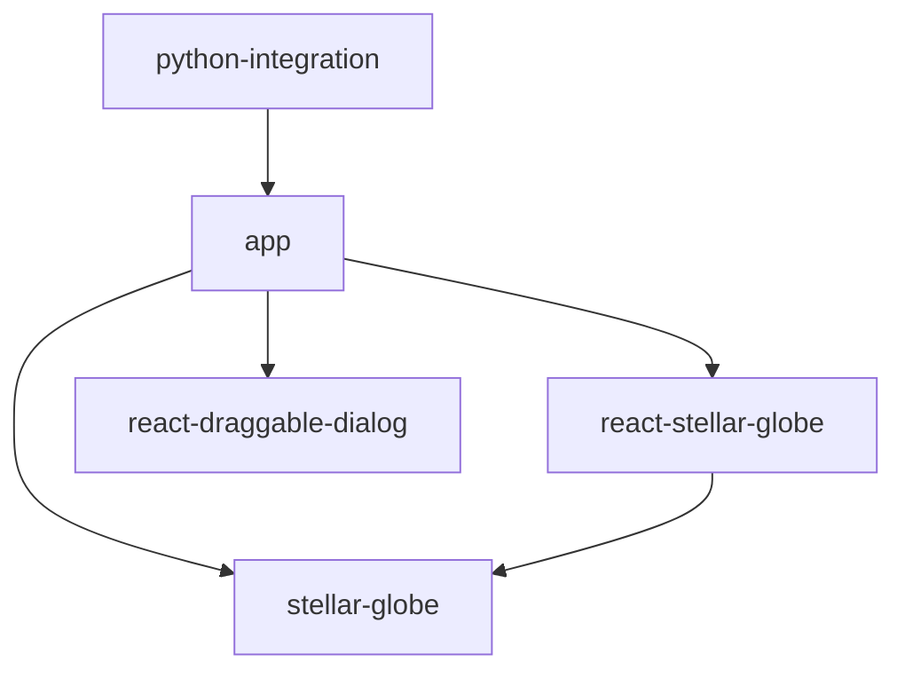

<!-- 
* app, stellar-globe, react-stellar-globe, react-draggable-dialogなどのコンポーネント目は `` で囲む
-->
# Stellar Globe

Stellar Globeは、Hyper Suprime-Cam (HSC) のPublic Data Releaseなどで使用されている全天ビューワープロジェクトです。
Webブラウザ上で動作し、大規模な天体画像データを高速かつ柔軟に表示することを目的としています。

## 主な特徴

* **高速な描画**: WebGLを利用し、任意の位置を任意の倍率で高速に表示できます。
* **動的なカラー合成**: 複数バンドのデータからクライアントサイドで動的にカラー画像を生成できます。
* **多様なフォーマット対応**: hscMap形式およびHiPS形式のデータに対応しています。
* **カタログオーバーレイ**: 画像上に天体カタログデータを重ねて表示することが可能です。

## コンポーネント構成と依存関係

このリポジトリは複数のコンポーネントで構成されるモノレポです。
各コンポーネントの役割と依存関係は以下の通りです。

### コアライブラリ

* **`stellar-globe`**
  * プロジェクトの中核となるライブラリです。
  * WebGLを用いた描画ロジック、シェーダー、データローディングなどの基本機能を提供します。
  * 他のReactコンポーネントには依存せず、独立して動作します。

### UIコンポーネント

* **`react-stellar-globe`**
  * `stellar-globe` をReactアプリケーションから容易に利用するためのラッパーコンポーネントです。
  * Reactのライフサイクルに合わせた管理や、宣言的なAPIを提供します。
  * `stellar-globe` に依存しています。

* **`react-draggable-dialog`**
  * ドラッグ可能なダイアログボックスを提供する汎用的なReactコンポーネントです。
  * ビューワー機能とは直接関係ありませんが、アプリケーションのUI構築に使用されます。
  * 他のコンポーネントへの依存はありません。

### アプリケーション

* **`app`**
  * 上記のコンポーネントを組み合わせて構築された、実際のビューワーアプリケーションです。
  * HSCのPDR内の `hscMap` アプリケーションの実装本体です。
  * `stellar-globe`, `react-stellar-globe`, `react-draggable-dialog` に依存しています。

### Python連携

* **`python-integration`**
  * Python環境（JupyterLabなど）から `app` を制御するためのツール群です。
  * 以下のサブコンポーネントを含みます。
    * `python`: Pythonクライアントライブラリ。
    * `jupyterlab-extension`: JupyterLab用の拡張機能。
    * `hscmap-server`: 独自のHTTPサーバー。

## 依存関係図

## Python連携について

Pythonから `app` のアプリケーションを操作することができます。
これにより、データ解析環境であるJupyterLabなどと連携し、解析結果をビューワー上に可視化したり、ビューワーの状態をPythonから制御したりすることが可能です。
`app` はJupyterLabのタブ内で動作させるか、または独自のHTTPサーバーを用いて動作させることができます。

## 本家リポジトリとミラー

本家リポジトリは以下にあります:
* https://hsc-gitlab.mtk.nao.ac.jp/michitaro/stellar-globe2

その他のリポジトリ（GitHub等）はミラーです。

## Issue/問題の報告

Issue（問題報告・要望）は日本語または英語で受け付けています。
本家リポジトリまたはミラーのいずれかにIssueを作成してください。

