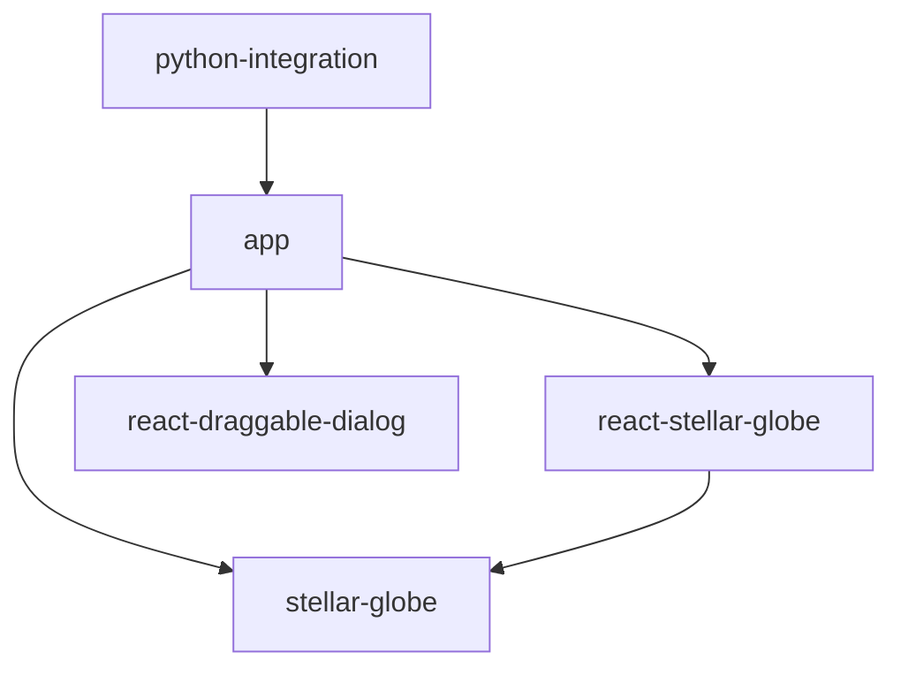

<!-- 
* app, stellar-globe, react-stellar-globe, react-draggable-dialogなどのコンポーネント目は `` で囲む
-->
# Stellar Globe

Stellar Globeは、Hyper Suprime-Cam (HSC) のPublic Data Releaseなどで使用されている全天ビューワープロジェクトです。
Webブラウザ上で動作し、大規模な天体画像データを高速かつ柔軟に表示することを目的としています。

**本アプリケーションは、国立天文台の[HSC-SSPプロジェクト](https://hsc.mtk.nao.ac.jp/ssp/)の一環として開発されています。**

## 主な特徴

* **高速な描画**: WebGLを利用し、任意の位置を任意の倍率で高速に表示できます。
* **動的なカラー合成**: 複数バンドのデータからクライアントサイドで動的にカラー画像を生成できます。
* **多様なフォーマット対応**: hscMap形式およびHiPS形式のデータに対応しています。
* **カタログオーバーレイ**: 画像上に天体カタログデータを重ねて表示することが可能です。

## コンポーネント構成と依存関係

このリポジトリは複数のコンポーネントで構成されるモノレポです。
各コンポーネントの役割と依存関係は以下の通りです。

### コアライブラリ

* **`stellar-globe`**
  * プロジェクトの中核となるライブラリです。
  * WebGLを用いた描画ロジック、シェーダー、データローディングなどの基本機能を提供します。
  * 他のReactコンポーネントには依存せず、独立して動作します。

### UIコンポーネント

* **`react-stellar-globe`**
  * `stellar-globe` をReactアプリケーションから容易に利用するためのラッパーコンポーネントです。
  * Reactのライフサイクルに合わせた管理や、宣言的なAPIを提供します。
  * `stellar-globe` に依存しています。

* **`react-draggable-dialog`**
  * ドラッグ可能なダイアログボックスを提供する汎用的なReactコンポーネントです。
  * ビューワー機能とは直接関係ありませんが、アプリケーションのUI構築に使用されます。
  * 他のコンポーネントへの依存はありません。

### アプリケーション

* **`app`**
  * 上記のコンポーネントを組み合わせて構築された、実際のビューワーアプリケーションです。
  * HSCのPDR内の `hscMap` アプリケーションの実装本体です。
  * `stellar-globe`, `react-stellar-globe`, `react-draggable-dialog` に依存しています。

### Python連携

* **`python-integration`**
  * Python環境（JupyterLabなど）から `app` を制御するためのツール群です。
  * 以下のサブコンポーネントを含みます。
    * `python`: Pythonクライアントライブラリ。
    * `jupyterlab-extension`: JupyterLab用の拡張機能。
    * `hscmap-server`: 独自のHTTPサーバー。

## 依存関係図



## Python連携について

Pythonから `app` のアプリケーションを操作することができます。
これにより、データ解析環境であるJupyterLabなどと連携し、解析結果をビューワー上に可視化したり、ビューワーの状態をPythonから制御したりすることが可能です。
`app` はJupyterLabのタブ内で動作させるか、または独自のHTTPサーバーを用いて動作させることができます。

## ビルド手順

プロジェクト全体をビルドするには、以下のコマンドを実行します：

```bash
bash ./build.bash
```

### 前提条件

ビルドには以下の環境が必要です：

* **Node.js**: バージョン 18 以降を推奨
* **Python**: バージョン 3.12 以降（`python-integration` のビルドに必要）
* **npm/yarn**: Node.js パッケージマネージャー

### 依存パッケージの鮮度ポリシー

このリポジトリでは、公開から **30日未満** の外部依存パッケージを使用しない方針を導入しています。
ローカルの `file:` / `link:` 依存は対象外です。

確認コマンド:

```bash
python3 ./tools/check_dependency_freshness.py
```

`build.bash` と GitHub Actions からも同じチェックが実行されます。

### ビルドスクリプトの内容

`build.bash` は以下の順序でビルドを実行します：

1. **`stellar-globe`**: コアライブラリのビルド
2. **`react-stellar-globe`**: Reactラッパーのビルド
3. **`react-draggable-dialog`**: ダイアログコンポーネントのビルド
4. **`app`**: メインアプリケーションのビルド
   - 型検証用JSON Schemaの生成
   - ライブラリ版のビルド
   - スタンドアロン版のビルド
5. **`python-integration/python`**: Pythonライブラリのビルド（Python環境が必要）
6. **`python-integration/jupyterlab-extension`**: JupyterLab拡張のビルド
7. **`python-integration/jupyterlite`**: JupyterLite用ビルド

### 部分的なビルド

特定のコンポーネントのみビルドする場合は、各ディレクトリで `make` または `npm run build` を実行します：

```bash
# stellar-globeのみビルド
cd stellar-globe
npm install
npm run build

# appのみビルド
cd app
npm install
npm run build-lib        # ライブラリ版
npm run build-standalone # スタンドアロン版
```

### トラブルシューティング

**Python仮想環境のエラー**

`python-integration/python` のビルドで仮想環境がない場合、事前に以下を実行してください：

```bash
cd python-integration/python
make setup
```

**依存パッケージのエラー**

各コンポーネントで `npm install` を実行して依存パッケージをインストールしてください：

```bash
cd stellar-globe && npm install
cd ../react-stellar-globe && npm install
cd ../react-draggable-dialog && npm install
cd ../app && npm install
```

鮮度チェックだけを個別に確認したい場合は、リポジトリルートで `python3 ./tools/check_dependency_freshness.py` を実行してください。

### GitLab review app CI

GitLab CI では branch push ごとに review app 用 pipeline を動かし、review app のルートには成果物へのリンクをまとめたトップページを配置します。現在は `app` の standalone build を `standalone/`、`python-integration/jupyterlite` の静的出力を `jupyterlite/` 配下へ配備します。将来的に docs などの成果物を同じトップページから追加できる構成です。

- CI 定義: `.gitlab-ci.yml`
- review app 用スクリプト: `ci/review-app/`
- microk8s / Gateway API 用の共通 helper: `.github/skills/gitlab-microk8s-review-app-ci/bin/`

最低限、cluster に接続できる `REVIEW_APP_KUBECONFIG_B64` を GitLab CI variable に設定してください。必要に応じて `REVIEW_APP_GATEWAY_*`、`REVIEW_APP_REGISTRY_*`、`REVIEW_APP_BASE_URL` を上書きできます。既定では review app は `/review-apps/<project-name>/<branch-slug>/` にトップページを置き、各成果物は `standalone/` と `jupyterlite/` に配備されます。

## 本家リポジトリとミラー

本家リポジトリは以下にあります:
* https://hsc-gitlab.mtk.nao.ac.jp/michitaro/stellar-globe2

その他のリポジトリ（GitHub等）はミラーです。

## Issue/問題の報告

Issue（問題報告・要望）は日本語または英語で受け付けています。
本家リポジトリまたはミラーのいずれかにIssueを作成してください。
