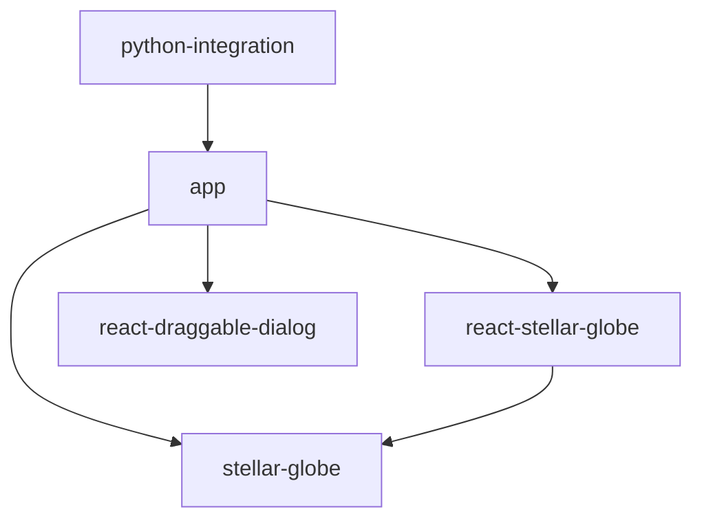

<!-- 
* Component names like app, stellar-globe, react-stellar-globe, react-draggable-dialog should be wrapped in ``
-->
# Stellar Globe

Stellar Globe is an all-sky viewer project used in the Hyper Suprime-Cam (HSC) Public Data Release and other applications.
It runs in web browsers and is designed to display large-scale astronomical image data quickly and flexibly.

**This application is being developed as part of the [HSC-SSP project](https://hsc.mtk.nao.ac.jp/ssp/) at the National Astronomical Observatory of Japan.**

## Key Features

* **High-speed rendering**: Utilizes WebGL to display any position at any zoom level quickly.
* **Dynamic color composition**: Dynamically generates color images from multi-band data on the client side.
* **Multiple format support**: Supports hscMap format and HiPS format data.
* **Catalog overlay**: Can overlay astronomical catalog data on images.

## Component Structure and Dependencies

This repository is a monorepo consisting of multiple components.
The roles and dependencies of each component are as follows:

### Core Library

* **`stellar-globe`**
  * The core library of the project.
  * Provides basic functionality including WebGL-based rendering logic, shaders, and data loading.
  * Operates independently without dependencies on React components.

### UI Components

* **`react-stellar-globe`**
  * A wrapper component for easily using `stellar-globe` from React applications.
  * Provides lifecycle management and declarative API aligned with React.
  * Depends on `stellar-globe`.

* **`react-draggable-dialog`**
  * A general-purpose React component providing draggable dialog boxes.
  * Not directly related to viewer functionality, but used for application UI construction.
  * Has no dependencies on other components.

### Application

* **`app`**
  * The actual viewer application built by combining the above components.
  * The implementation of the `hscMap` application in HSC PDR.
  * Depends on `stellar-globe`, `react-stellar-globe`, and `react-draggable-dialog`.

### Python Integration

* **`python-integration`**
  * Tools for controlling the `app` from Python environments (such as JupyterLab).
  * Includes the following sub-components:
    * `python`: Python client library.
    * `jupyterlab-extension`: JupyterLab extension.
    * `hscmap-server`: HTTP server that serves Stellar Globe on a command-line selected port and connects to the Python client over WebSocket.

## Dependency Graph



## Python Integration

The `app` application can be controlled from Python.
This enables integration with data analysis environments like JupyterLab, allowing visualization of analysis results in the viewer and control of viewer state from Python.
The `app` can run within a JupyterLab tab or using a custom HTTP server.
`python-integration/hscmap-server` provides the latter: start it with a command such as `hscmap-server --port 8000` to serve the viewer on the selected port.

## Build Instructions

To build the entire project, run the following command:

```bash
bash ./build.bash
```

### Prerequisites

The build requires the following environment:

* **Node.js**: Version 18 or later recommended
* **Python**: Version 3.12 or later (required for building `python-integration`)
* **npm**: Version 11 or later recommended (used for dependency-resolution freshness control via `min-release-age`)

### Dependency freshness policy

This repository blocks external dependencies that were published less than **30 days** ago.
Each npm project sets `min-release-age=30` in `.npmrc` so `npm install` avoids too-new versions during dependency resolution.
Python projects use `exclude-newer = "30 days"` in their `uv` configuration so the same restriction applies during `uv lock` and `uv sync`.
Local `file:` / `link:` dependencies and path/editable dependencies are excluded from the policy.

### Build Script Details

`build.bash` executes builds in the following order:

1. **`stellar-globe`**: Build the core library
2. **`react-stellar-globe`**: Build the React wrapper
3. **`react-draggable-dialog`**: Build the dialog component
4. **`app`**: Build the main application
   - Generate JSON Schema for type validation
   - Build library version
   - Build standalone version
5. **`python-integration/python`**: Build Python library (requires Python environment)
6. **`python-integration/jupyterlab-extension`**: Build JupyterLab extension
7. **`python-integration/jupyterlite`**: Build for JupyterLite

### Partial Build

To build only specific components, run `make` or `npm run build` in each directory:

```bash
# Build only stellar-globe
cd stellar-globe
npm install
npm run build

# Build only app
cd app
npm install
npm run build-lib        # Library version
npm run build-standalone # Standalone version
```

### Troubleshooting

**Python Virtual Environment Errors**

If the build for `python-integration/python` fails due to missing virtual environment, run the following first:

```bash
cd python-integration/python
make setup
```

**Dependency Package Errors**

Install dependencies for each component by running `npm install`:

```bash
cd stellar-globe && npm install
cd ../react-stellar-globe && npm install
cd ../react-draggable-dialog && npm install
cd ../app && npm install
```

The freshness policy is applied automatically during dependency resolution with `npm install`, `uv lock`, and `uv sync`.

### GitLab review app CI

GitLab CI now builds a review app on branch pushes with a landing page at the review app root. The landing page links to the currently published products: the standalone `app` build under `standalone/`, the static build of `stellar-globe/demo` under `stellar-globe/`, the static build of `react-stellar-globe/examples` under `react-stellar-globe/`, the static build of `react-draggable-dialog/example` under `react-draggable-dialog/`, the static `python-integration/jupyterlite` output under `jupyterlite/`, and the Playwright HTML report for JupyterLite E2E under `jupyterlite-e2e/`.

- CI definition: `.gitlab-ci.yml`
- Review app scripts: `ci/review-app/`
- Shared microk8s / Gateway API helpers: `.github/skills/gitlab-microk8s-review-app-ci/bin/`

At minimum, configure `REVIEW_APP_KUBECONFIG_B64` as a GitLab CI variable so jobs can reach the target cluster. You can also override `REVIEW_APP_GATEWAY_*`, `REVIEW_APP_REGISTRY_*`, and `REVIEW_APP_BASE_URL` as needed. By default, review apps are published under `/review-apps/<project-name>/<branch-slug>/` with a landing page at the root, and products are available under `standalone/`, `stellar-globe/`, `react-stellar-globe/`, `react-draggable-dialog/`, `jupyterlite/`, and `jupyterlite-e2e/`. The build job also keeps `python-integration/jupyterlite/test-results/` and `playwright-report/` as CI artifacts so screenshots, videos, and traces remain downloadable even when the review app is not inspected directly.

## Main Repository and Mirrors

The main repository is located at:
* https://hsc-gitlab.mtk.nao.ac.jp/michitaro/stellar-globe2

Other repositories (such as GitHub) are mirrors.

## Issue Reporting

Issues (bug reports and feature requests) are accepted in Japanese or English.
Please create an issue in either the main repository or any mirror.
