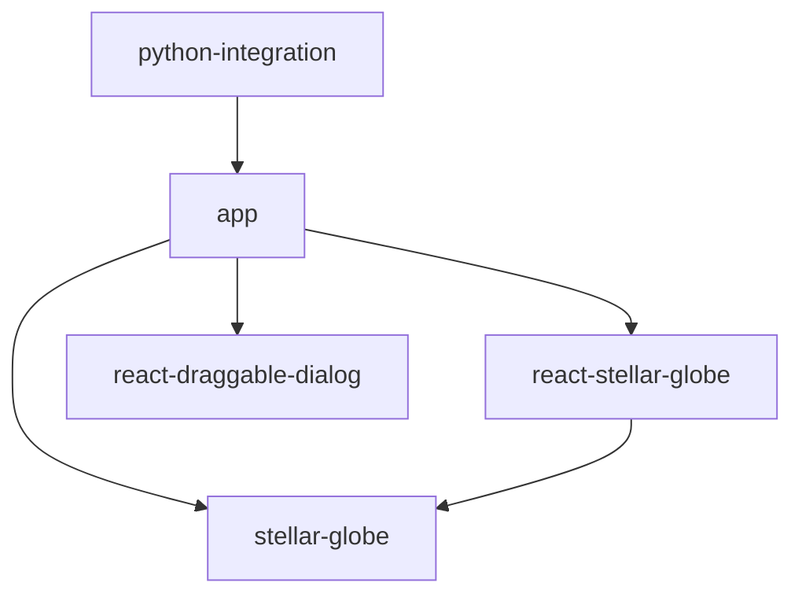

# Stellar Globe

Stellar Globe is an all-sky viewer project used in the Hyper Suprime-Cam (HSC) Public Data Release and other applications.
It runs in web browsers and aims to display large-scale astronomical image data quickly and flexibly.

## Key Features

* **High-speed rendering**: Utilizes WebGL to display any position at any zoom level quickly.
* **Dynamic color composition**: Dynamically generates color images from multi-band data on the client side.
* **Multiple format support**: Supports hscMap format and HiPS format data.
* **Catalog overlay**: Can overlay astronomical catalog data on images.

## Component Structure and Dependencies

This repository is a monorepo consisting of multiple components.
The roles and dependencies of each component are as follows:

### Core Library

* **`stellar-globe`**
  * The core library of the project.
  * Provides basic functionality including WebGL-based rendering logic, shaders, and data loading.
  * Operates independently without dependencies on React components.

### UI Components

* **`react-stellar-globe`**
  * A wrapper component for easily using `stellar-globe` from React applications.
  * Provides lifecycle management and declarative API aligned with React.
  * Depends on `stellar-globe`.

* **`react-draggable-dialog`**
  * A general-purpose React component providing draggable dialog boxes.
  * Not directly related to viewer functionality, but used for application UI construction.
  * Has no dependencies on other components.

### Application

* **`app`**
  * The actual viewer application built by combining the above components.
  * The implementation of the `hscMap` application in HSC PDR.
  * Depends on `stellar-globe`, `react-stellar-globe`, and `react-draggable-dialog`.

### Python Integration

* **`python-integration`**
  * Tools for controlling the `app` from Python environments (such as JupyterLab).
  * Includes the following sub-components:
    * `python`: Python client library.
    * `jupyterlab-extension`: JupyterLab extension.
    * `hscmap-server`: Custom HTTP server.

## Dependency Graph

## Python Integration

The `app` application can be controlled from Python.
This enables integration with data analysis environments like JupyterLab, allowing visualization of analysis results in the viewer and control of viewer state from Python.
The `app` can run within a JupyterLab tab or using a custom HTTP server.

## Main Repository and Mirrors

The main repository is located at:
* https://hsc-gitlab.mtk.nao.ac.jp/michitaro/stellar-globe2

Other repositories (such as GitHub) are mirrors.

## Issue Reporting

Issues (bug reports and feature requests) are accepted in Japanese or English.
Please create an issue in either the main repository or any mirror.
